[](
  https://ide.dwavesys.io/#https://github.com/dwave-examples/tour-planning)

# Tour Planning

A demonstration of using hard and soft constraints on the Leap&trade;
quantum-classical hybrid constrained quadratic model (CQM) solver.

This example solves a problem of selecting, for a tour divided into several legs
of varying lengths and steepness, a combination of locomotion modes (walking,
cycling, bussing, and driving) such that one can gain the greatest benefit of
outdoor exercise while not exceeding one's budgeted cost and time.

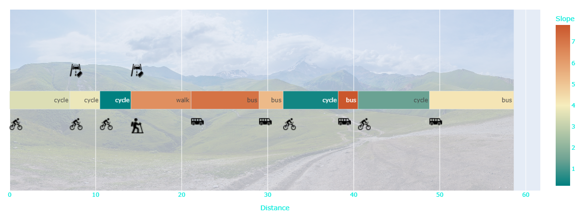

The techniques used in this example are applicable to commercial problems such
as traffic routing&mdash;selecting the optimal among available means of
transportation, for commuters or deliveries, given constraints of pricing,
speed, convenience, and green-energy preferences&mdash;or network routing, where
the routing of data packets must consider bandwidth, pricing, reliance,
service tiers, and latency across numerous hops.

* [Hard and Soft Constraints](#Hard-and-Soft-Constraints)
* [Installation](#Installation)
* [Usage](#Usage)
* [Model Overview](#Model-Overview)
* [Code](#Code)
* [License](License)

## <a name="Hard-and-Soft-Constraints"></a> Hard and Soft Constraints

Constraints for optimization problems are often categorized as either “hard” or
“soft”.

Any hard constraint  must be satisfied for a solution of the problem to qualify
as feasible. Soft constraints may be violated to achieve an overall good solution.

By setting appropriate weights to soft constraints in comparison to the objective
and to other soft constraints, you can express the relative importance of such
constraints. Soft constraints on binary variables can be one of two types:

* linear: the penalty for violating such a constraint is proportional to the
  value of the violation (i.e., by how much the constraint is violated).
* quadratic: the penalty for violating such a constraint is proportional to the
  square of the value of the violation.

For example, for a soft constraint on the tour's maximum cost, with a price of 3
for driving, preferring to drive over free locomotion on a leg of length 2 adds
a penalty of 6 or 36, for a linear or quadratic constraint, respectively, that
goes up, for a leg length of 3, to 9 and 81, respectively. Such a quadratic
constraint severely discourages driving on longer legs.

This example enables you to set hard or soft constraints on the tour's cost, its
duration, and the steepest leg one can walk or cycle. The CQM has hard constraints
that ensure a single mode of locomotion is selected for each leg and, optionally,
prevent driving on legs with toll booths.  

### Example Results

Some of the variety of results you can obtain from the application of these
constraints are shown below for an example tour[^1].

<details><summary>1. All constraints are hard.</summary>
For this case, acceptable solutions must satisfy all
constraints, and the solver was unable to find a feasible solution.

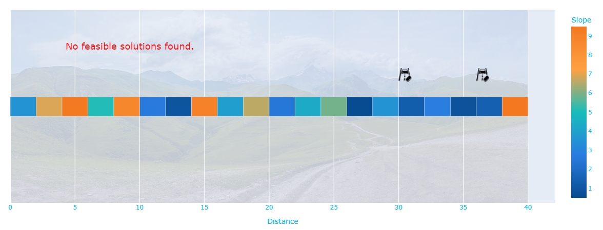
</details>

<details><summary>2. Constraints on cost and time are relaxed to soft constraints.</summary>
The solver
tries to satisfy such constraints but accepts solutions that violate one or more.
Now the solver returns a solution. However, it provides little exercise
because cycling is not allowed on legs even slightly steeper than the configured
maximum.

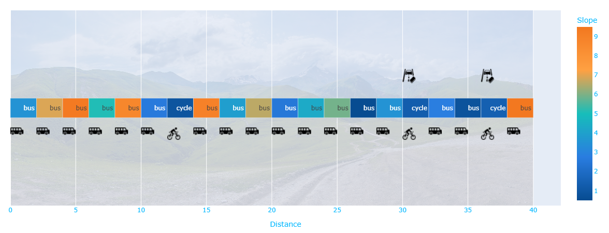
</details>

<details><summary>3. Constraint on slope is also relaxed.</summary>
Now the returned solution is to cycle on all but the steepest slopes, gaining exercise
by tolerating a wide margin of violations of the slope constraint.


</details>

<details><summary>4. Soft constraint on slope is set to quadratic.</summary>
Now the solver discriminates sharply between slopes that are just a bit over the
configured maximum and those significantly too steep. The returned solution allows
for cycling on legs that violate the slope constraint by a narrow margin.


</details>

[^1]: The tour comprises 20 legs of equal length, 2, with budgeted cost of 150 and
duration of 5, and a steepest leg for exercising of 2. Cycling (speed 3, cost 2)
and bussing (speed 5, cost 4) are the available modes of locomotion. For soft
constraints, weights are set to 5.

In general, the use of soft constraints can result in imperfect but good solutions
to many optimization problems: for example, in
[three-dimensional bin packing](https://github.com/dwave-examples/3d-bin-packing),
which addresses problems in areas such as containers, pallets and aircraft, boxes
should be fully supported to ensure stability; however, satisfying such a hard
constraint might not be possible due to a variety of box sizes or bin size. Using
a soft constraint that enables solutions with 70% support might be acceptable.
Another example is
[job shop scheduling](https://github.com/dwave-examples/job-shop-scheduling-cqm),
where jobs should complete on time. If this constraint cannot be met
due to conflicting constraints, a soft constraint that penalizes delays by length
might return good solutions.

## <a name="Installation"></a> Installation

This example can be run in the Leap IDE by accessing the following URL:

    https://ide.dwavesys.io/#https://github.com/dwave-examples/tour-planning


Alternatively, install requirements locally. Ideally, in a virtual environment.

    pip install -r requirements.txt

## <a name="Usage"></a> Usage

To run the demo:

```bash
python app.py
```

Access the user interface with your browser at http://127.0.0.1:8050/.

The demo program opens an interface where you can configure tour
problems, submit these problems to a CQM solver, and examine the results.

*Hover over an input field to see a description of the input and its range of*
*supported values.*

### Configuring the Tour

The upper-left section of the user interface lets you configure the tour's legs:
how many, how long, and the maximum elevation gain.
Additionally, you can configure your budgets of cost and time for the entire
tour: modes of locomotion vary in price and speed. For example, walking is free
but slower than driving. Finally, you can chose whether or not to add tollbooths
randomly to 20% of the legs.

Leg lengths are set to a uniform random value between your configured minimum and
maximum values. Steepness is set uniformly at random between zero and ten.

A leg's steepness affects exercising: a constraint is set to discourage (soft
constraint) or disallow (hard constraint) walking or cycling on those legs that
exceed the maximum slope you configured.

When you update a tour's legs, toll booths may be placed at random on some of the
legs (each leg has a 20% probability that it is given a tollbooth). These affect
driving in a private car (but not bussing): the generated CQM has a hard constraint
to not drive on legs with toll booths. This constraint is optional.

### Configuring the Constraints

The upper-middle section of the user interface lets you tune the constraints
on cost, time, and steepness.

You can select whether to use hard or soft constraints, and for soft constraints,
you can set weights and chose between linear or quadratic penalties.

### Submitting the Problem for Solution

The upper-right section of the user interface lets you submit your problem
to a Leap hybrid CQM solver. The default solver runtime of 5 seconds is used
unless you choose to increase it.

### Problem Details and Solutions

The lower section's following tabs contain information about the problem and any
found solutions.

* **Graph:** displays the configured problem and any found solutions in three ways:

  - **Space:** displays relative leg lengths, steepness as a
    color heatmap, and toll booths as icons above the colored bar representing
    the tour. Modes of locomotion for the best solution found are displayed as
    icons below it.
  - **Time:** displays relative leg duration and, for the best found solution,
    the cost per leg as a color heatmap.   
  - **Feasibility:** displays feasible and non-feasible solutions in a
    three-dimensional plot of exercise, cost, and time.

* **Problem:** displays the legs of the tour (length, slope, and toll booths),
  formatted for reading and for copying into your code.

* **Solutions:** displays the returned solutions, formatted for reading and as
  a [dimod sampleset](
https://docs.ocean.dwavesys.com/en/stable/docs_dimod/reference/sampleset.html)
  for copying into your code.

* **CQM:** displays the constrained quadratic model generated for your configured
  tour and constraints. A good way to learn about the construction of a CQM, is
  to begin with a minimal problem (a single mode of locomotion, one leg, no
  tollbooths), study the simple CQM, and watch it change as you increase the
  problem's complexity.

* **Locomotion:** contains information about your configured tour, such as the
  minimum, maximum, and average values of cost and time, and the values for
  the available modes of locomotion (speed, cost, exercise) that **you can configure**.

## <a name="Model-Overview"></a> Model Overview

The problem of selecting a mode of locomotion for every leg of the tour to achieve
some objective (maximize exercise) given a number of constraints (e.g., do not
overpay) can be modeled as an optimization problem with decisions that could
either be true or false: for any leg, should one drive? Should one
walk?

This model uses up to four binary variables for each leg of the tour, each one
representing whether one particular mode of locomotion is used or not. For example,
leg number 5 might have the following binary variables and values in one solution:

| Binary Variable        | Represents    | Value in a Particular Solution |
|------------------------|---------------|--------------------------------|
| ``walk_5``             | Walk leg 5    | False                          |
| ``cycle_5``            | Cycle leg 5   | True                           |
| ``bus_5``              | Bus leg 5     | False                          |
| ``drive_5``            | Drive leg 5   | False                          |

In the solution above, cycling is the mode of locomotion selected for leg 5.

The CQM is built as follows with a single objective and several constraints:

* **Objective: Maximize Exercise**

    To maximize exercise on the tour, the CQM objective is to minimize the negative
    summation of values of exercise set for each locomotion mode across all the
    tour's legs.

    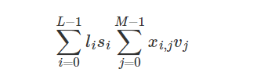

    The terms above are as follows:

    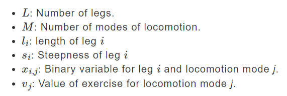

    Because a single mode of locomotion is selected for each leg (as explained
    below), all the products but one are zeroed by the binary variables of that
    leg. For example, in leg 5 in the solution above, the leg length is
    multiplied by its slope and the exercise value of cycling because, for this
    leg, the binary variable representing cycling is the only non-zero variable.

* **Constraint 1: Cost**

    To discourage or prevent the tour's cost from exceeding
    your preferred budget, the CQM sets a constraint that the total cost over
    all legs is less or equal to your configured cost. It does this by minimizing
    the summation of leg lengths multiplied by the cost value of locomotion mode
    for the leg. This can be a hard or soft constraint.

    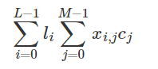

    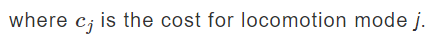

    Again, for each leg the only non-zero product has the binary variable
    representing the selected locomotion mode.

* **Constraint 2: Time**

    To discourage or prevent the tour's duration from exceeding your configured
    value, the CQM sets a constraint similar to that on cost but with the leg
    length divided by the value of speed for each mode of locomotion. This can be
    a hard or soft constraint.

    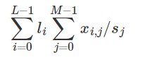

    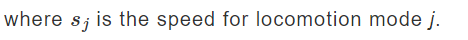

* **Constraint 3: Steep Legs**

    To discourage or prevent the selection of exercising on legs where the slope
    is steeper than your configured maximum, the CQM sets a constraint that
    for each leg the binary variables representing walking and cycling multiplied
    by the slope be less or equal to your configured highest slope.
    This can be a hard or soft constraint.

    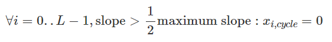

* **Constraint 4: Single Mode of Locomotion Per Leg**

    To ensure a single mode of locomotion is selected for each
    leg, the sum of the binary variables representing each leg must equal one
    (a ["one-hot" constraint](https://docs.dwavesys.com/docs/latest/handbook_reformulating.html)).
    This is a hard constraint.

    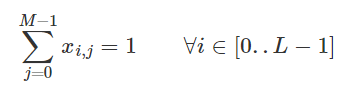

* **Constraint 5: Toll Booths**

    This optional constraint prevents driving on legs with toll booths. If you
    choose to enable the placement of tollbooths on some legs (tollbooths may be
    placed at random on a leg with 20% probability), the CQM sets a constraint
    that the binary variable representing driving be zero for any leg with a
    toll booth. This is a hard constraint.

    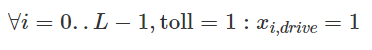

## <a name="Code"></a> Code

Most the code related to configuring the CQM is in the
[tour_planning.py](tour_planning.py) file. The remaining files mostly support
the user interface.

---
**Note:** Standard practice for submitting problems to Leap solvers is to use
a [dwave-system](https://docs.ocean.dwavesys.com/en/stable/docs_system/sdk_index.html)
sampler; for example, you typically use
[LeapHybridCQMSampler](https://docs.ocean.dwavesys.com/en/stable/docs_system/reference/samplers.html)
for CQM problems. The code in this example uses the
[dwave-cloud-client](https://docs.ocean.dwavesys.com/en/stable/docs_cloud/sdk_index.html),
which enables finer control over communications with the Solver API (SAPI).

If you are learning to submit problems to Leap solvers, use a ``dwave-system``
solver, with its higher level of abstraction and thus greater simplicity,
as demonstrated in most the code examples of the
[example collection](https://github.com/dwave-examples) and in the
[Ocean documentation](https://docs.ocean.dwavesys.com/en/stable/index.html).

---

## License

Released under the Apache License 2.0. See [LICENSE](LICENSE) file.
